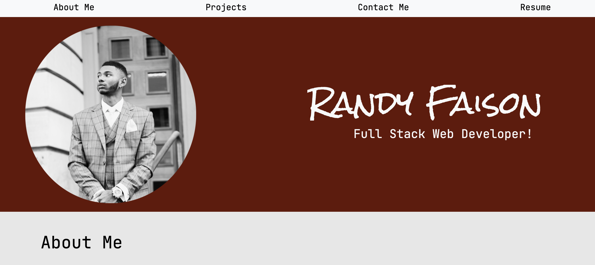

# React Portfolio

## License
 : [View License](https://opensource.org/licenses/MIT)

## Deployed App

## Table of Contents

- [Title](#React-Portfolio)
- [License](#License)
- [Description](#Description)
- [Installation](#Installation)
- [Usage](#Usage)
- [Questions](#Questions)

## Description
This portfolio was built using React, and includes the following applications: 

- Note Taker

- Workout Tracker 

- Readme Generator 

- Team profile Generator.

## Installation 
`npm install` OR `npm i`

## Usage
`npm start` - Runs the app in the development mode.

Open http://localhost:3000 to view it in the browser.

## Questions 
For issues, questions, and comments please contact randyfaison@gmail.com or visit [https://github.com/randyfasion](https://github.com/randyfasion) 

